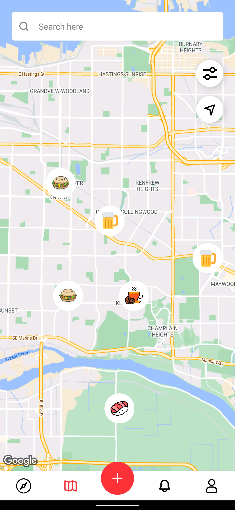
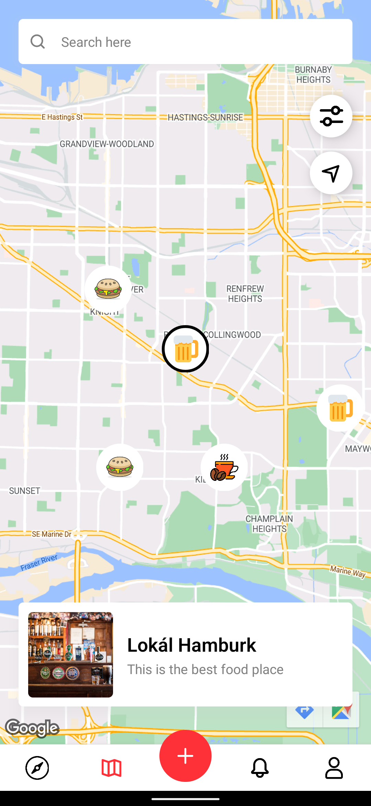
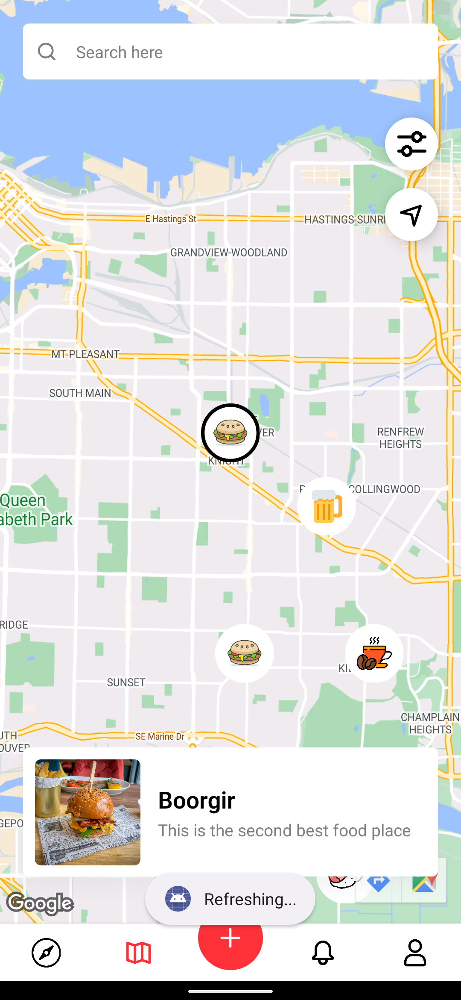
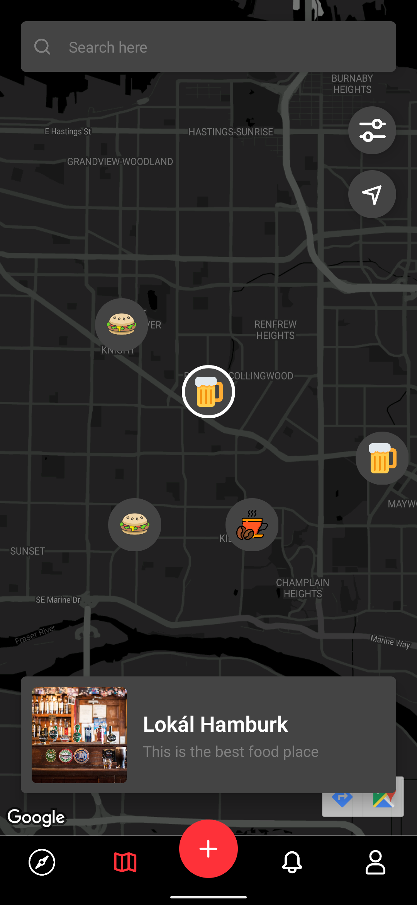
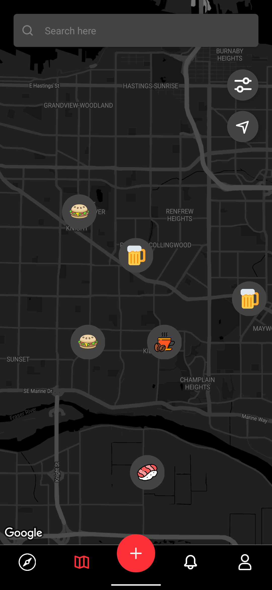
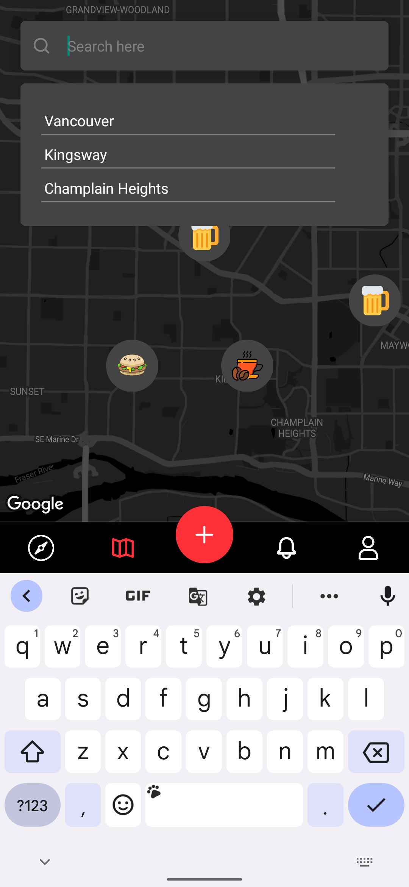

# Custom Map

## To run the code

Step 1: git clone [this repo's url]

Step 2: npm install

Step 3: Put in your API key in android/app/src/main/AndroidManifest.xml in place of "YourApiKey"

Step 4: npx react-native run-android

## To install the apk

Put runThis.apk in your device and enjoy!

Below are the screenshots of the app:-

